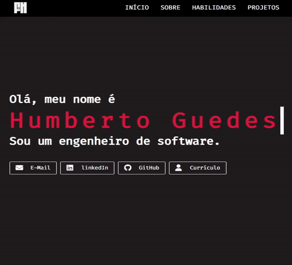

<h1 align="center">
  <br>
  <b>Nexo</b>
  <br>
</h1>

<p align="center">
  <a href="#sobre">Sobre</a> •
  <a href="#tecnologias">Tecnologias</a> •
  <a href="#fundamentos">Fundamentos</a> •
  <a href="#como-rodar">Como rodar?</a> •
  <a href="#licença">Licença</a>
</p>

<div align="center">
  
</div>

## **Sobre**

Este projeto foi desenvolvido com o intuito de consolidar todas as informações relevantes sobre minha trajetória profissional e interesses na área de programação.

## **Informações Técnicas**

### **Tecnologias**

O projeto foi construído utilizando as seguintes tecnologias:

* Blazor WebAssembly
* C# 10
* .NET 8

### **Fundamentos**

Por design, o projeto foi construido utilizando os seguintes fundamentos:

* Design simples e direto.
* Estrutura modular para garantir a flexibilidade dos dados, evitando alterações constantes na base do projeto.
* Camada única de apresentação, sem inclusão de back-end, para se enquadrar a hospedagem estática no GitHub Pages.

### **Como Rodar?**

#### **1. Preparação**

Para clonar este repositório, você precisará ter o [Git](https://git-scm.com) e o .NET 8, instalado em sua máquina sua máquina.

#### **2. Rodando**

> A aplicação pode ser executada na interface do Visual Studio ou usando o modo debug no VSCode.

Para compilar e executar a aplicação pelo terminal, utilize os seguintes comandos:

```shell
dotnet build
```

```shell
dotnet run --project <CAMINHO_DO_PROJETO>
```
